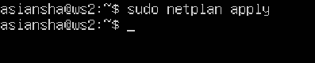

# Отчёт по проекту "Сети в Linux"

Настройка сетей в Linux на виртуальных машинах.

## Содержание
1. [Part 1. Инструмент ipcalc](#part1) \
    1.1 [Сети и маски](#part1_1) \
    1.2 [localhost](#part1_2) \
    1.3. [Диапазоны и сегменты сетей](#part1_3) 
2. [Part 2. Статическая маршрутизация между двумя машинами](#part2) \
    2.1. [Добавление статического маршрута вручную](#part2_1) \
    2.2. [Добавление статического маршрута с сохранением](#part2_2)
---
## Part 1. Инструмент ipcalc <div id='part1'/>
#### 1.1. Сети и маски <div id='part1_1'/>
##### Определить и записать в отчёт:
##### 1)адрес сети 192.167.38.54/13
- установил ipcalc

    
    
- отпределил адрес сети **192.167.38.54/13**. В данном случае адрес сети – 192.160.0.0

    

##### 2) перевод маски 255.255.255.0 в префиксную и двоичную запись, /15 в обычную и двоичную, 11111111.11111111.11111111.11110000 в обычную и префиксную

- 255.255.255.0(обычная запись) = /24(префиксная запись) = 11111111.11111111.11111111.00000000 (двоичная запись)

    

- /15(префиксная запись) = 255.254.0.0(обычная запись) =  = 11111111.11111110.00000000.00000000 (двоичная запись)

    

- 11111111.11111111.11111111.11110000 (двоичная запись) = 255.255.255.240(обычная запись) = /28(префиксная запись) 

    

##### 3) минимальный и максимальный хост в сети 12.167.38.4 при масках:

- /8:
    - HostMin: 12.0.0.1
    - HostMax: 12.255.255.254
    
    

- 11111111.11111111.00000000.00000000:
    - HostMin: 12.167.0.1
    - HostMax: 12.167.255.254   

    

- 255.255.254.0: 
    - HostMin: 12.167.38.1
    - HostMax: 12.167.39.254

    

- /4:
    - HostMin: 0.0.0.1
    - HostMax: 15.255.255.254 

    

#### 1.2. localhost <div id='part1_2'/>

##### Определить и записать в отчёт, можно ли обратиться к приложению, работающему на localhost, со следующими IP:

> **localhost**  — в компьютерных сетях, стандартное, официально зарезервированное доменное имя для частных IP-адресов в диапазоне **`127.0.0.1`** — **`127.255.255.254`** 

- 194.34.23.100 => нельзя

- 127.0.0.2 => можно

- 127.1.0.1 => можно

- 128.0.0.1 => нельзя

#### 1.3. Диапазоны и сегменты сетей <div id='part1_3'/>

##### Определить и записать в отчёт:

##### 1) какие из перечисленных IP можно использовать в качестве публичного, а какие только в качестве частных:

- ниже представлены диапазоны для частных сетей (остальные относятся к публичным)

|Класс | Диапазоны частных сетей        |
|------|--------------------------------|
| A    |10.0.0.0 – 10.255.255.255       |
| B    |172.16.0.0 – 172.31.255.255     |
| C    |192.168.0.0 – 192.168.255.255   |

- из данной таблицы следует:

```
            Частные IP                  Публичные IP
            10.0.0.45                   134.43.0.2
            192.168.4.2                 172.0.2.1 
            172.20.250.4                192.172.0.1
            172.16.255.255              172.68.0.2
            10.10.10.10                 192.169.168.1                                               
```
##### 2) какие из перечисленных IP адресов шлюза возможны у сети 10.10.0.0/18: 

> для сети **10.10.0.0/18** диапазон IP адресов шлюза будет от **10.10.0.1** (HostMin) до **10.10.63.254** (HostMax)
- возможные IP адреса:
    - 10.10.0.2, 10.10.10.10, 10.10.1.255
- недопустимые IP адреса:
    - 10.0.0.1, 10.10.100.1

---

## Part 2. Статическая маршрутизация между двумя машинами <div id='part2'/>

- Поднять две виртуальные машины (далее -- ws1 и ws2)

    

- С помощью команды `ip a` посмотреть существующие сетевые интерфейсы
    - для **ws1**:

        

    - для **ws2**:

        

- Задать следующие адреса и маски: 
    - для **ws1** - *192.168.100.10/16* и выполнить команду `netplan apply` для перезапуска сервиса сети применения конфигурации

        
        

    - для **ws2** - *172.24.116.8/12* и выполнить команду `netplan apply` для перезапуска сервиса сети применения конфигурации

        
        


>   *Краткое пояснение к конфигурации*:
    **network** - указывает, что мы будем иметь дело с сетью;
    **ethernets** - вид сетевого интерфейса, который мы настраиваем;
    **enp0s3** - имя сетевого интерфейса в системе;
    **addresses** - добавляет статические адреса к интерфейсу;
    **dhcp4** - получение IPv4 адреса по DHCP, которое в данном случае необходимо отключить;
    **version** -  указывает версию стандарта конфигурации, которая будет использоваться.


- проверка сетевых интерфесов для ws1

    

- проверка сетевых интерфесов для ws2

    


#### 2.1. Добавление статического маршрута вручную <div id='part2_1'/>

- Добавление статических маршрутов может быть выполнено командой: `ip r add [address we want to connect to] dev [network name]`

- Добавление статического маршрута от **ws1** до **ws2** и пропинговка соединения между ними:

    

- Добавление статического маршрута от **ws2** до **ws1** и пропинговка соединения между ними:

    

#### 2.2. Добавление статического маршрута с сохранением <div id='part2_2'/>
    
- Перезапуск машин с помощью команды `reboot`
- Добавление статического маршрута от **ws1** до **ws2** с помощью файла **etc/netplan/00-installer-config.yaml** и `sudo netplan apply` для перезапуска сервиса сети:

    

- Добавление статического маршрута от **ws2** до **ws1** с помощью файла **etc/netplan/00-installer-config.yaml** и `sudo netplan apply` для перезапуска сервиса сети:

    

> Параметр **routes** в конфигурационном файле позволяет настроить маршруты таблицы маршрутизации

- Пропинговать соединение между машинами:
    - от **ws1** до **ws2**:

        

    - от **ws2** до **ws1**:

        

--- 
