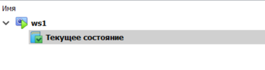
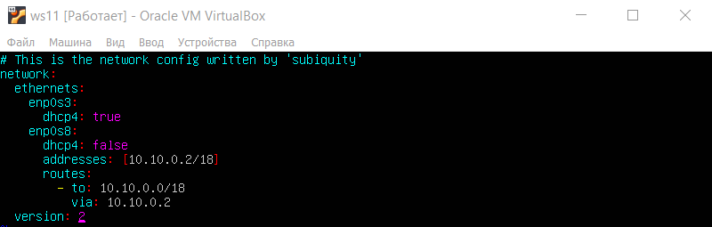
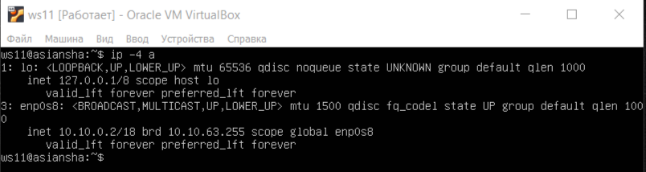
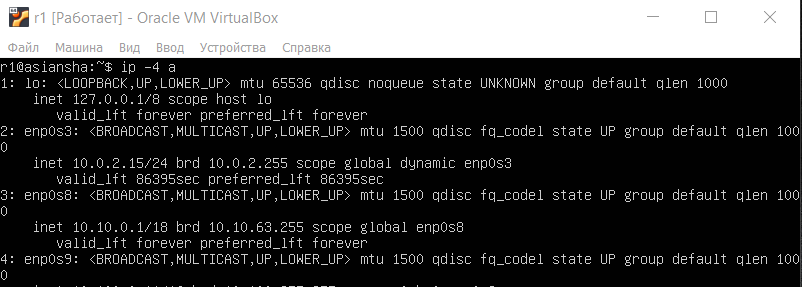
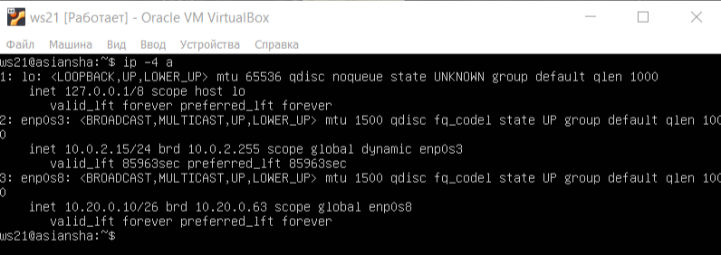
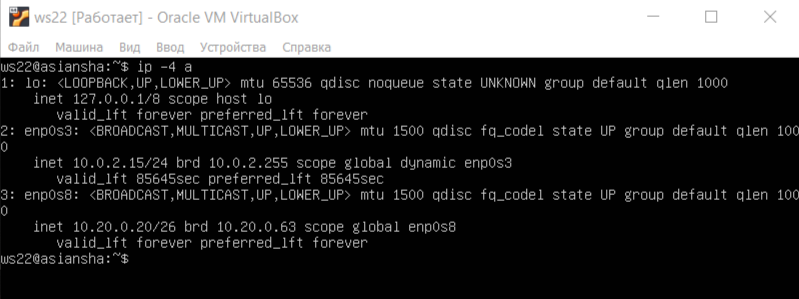
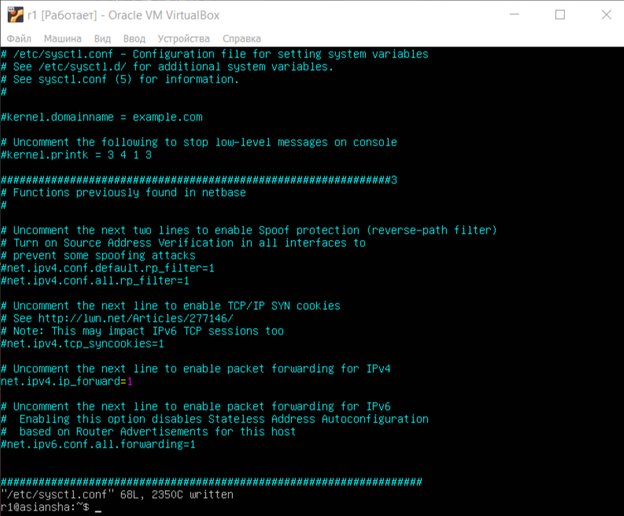
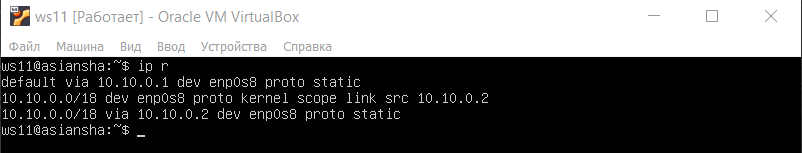
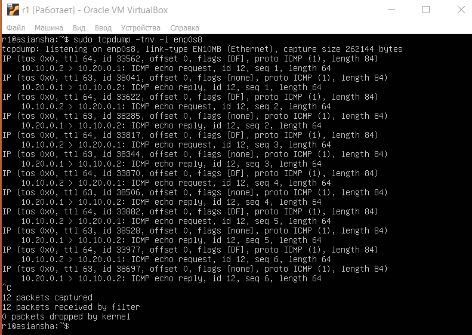
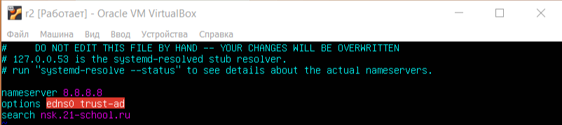

# Отчёт по проекту "Сети в Linux"

Настройка сетей в Linux на виртуальных машинах.

## Содержание
1. [Инструмент ipcalc](#part1) \
    1.1 [Сети и маски](#part1_1)  
    1.2 [localhost](#part1_2) \
    1.3. [Диапазоны и сегменты сетей](#part1_3) 
2. [Статическая маршрутизация между двумя машинами](#part2) \
    2.1. [Добавление статического маршрута вручную](#part2_1) \
    2.2. [Добавление статического маршрута с сохранением](#part2_2) 
3. [Утилита iperf3](#part3) \
    3.1. [Скорость соединения](#part3_1) \
    3.2. [Утилита iperf3](#part3_2) 
4. [Сетевой экран](#part4) \
    4.1. [Утилита iptables](#part4_1) \
    4.2. [Утилита nmap](#part4_2) 
5. [Статическая маршрутизация сети](#part5) \
    5.1. [Настройка адресов машин](#part5_1) \
    5.2. [Включение переадресации IP-адресов](#part5_2) \
    5.3. [Установка маршрута по-умолчанию](#part5_3) \
    5.4. [Добавление статических маршрутов](#part5_4) \
    5.5. [Построение списка маршрутизаторов](#part5_5) \
    5.6. [Использование протокола ICMP при маршрутизации](#part5_6) 
6. [Динамическая настройка IP с помощью DHCP](#part6) \
7. 

---
    
 
## Part 1. Инструмент ipcalc <div id='part1'/>
#### 1.1. Сети и маски <div id='part1_1'/>
##### Определить и записать в отчёт:
##### 1)адрес сети 192.167.38.54/13
- установил ipcalc

    
    
- отпределил адрес сети **192.167.38.54/13**. В данном случае адрес сети – 192.160.0.0

    

##### 2) перевод маски 255.255.255.0 в префиксную и двоичную запись, /15 в обычную и двоичную, 11111111.11111111.11111111.11110000 в обычную и префиксную

- 255.255.255.0(обычная запись) = /24(префиксная запись) = 11111111.11111111.11111111.00000000 (двоичная запись)

    

- /15(префиксная запись) = 255.254.0.0(обычная запись) =  = 11111111.11111110.00000000.00000000 (двоичная запись)

    

- 11111111.11111111.11111111.11110000 (двоичная запись) = 255.255.255.240(обычная запись) = /28(префиксная запись) 

    

##### 3) минимальный и максимальный хост в сети 12.167.38.4 при масках:

- /8:
    - HostMin: 12.0.0.1
    - HostMax: 12.255.255.254
    
    

- 11111111.11111111.00000000.00000000:
    - HostMin: 12.167.0.1
    - HostMax: 12.167.255.254   

    

- 255.255.254.0: 
    - HostMin: 12.167.38.1
    - HostMax: 12.167.39.254

    

- /4:
    - HostMin: 0.0.0.1
    - HostMax: 15.255.255.254 

    

#### 1.2. localhost <div id='part1_2'/>

##### Определить и записать в отчёт, можно ли обратиться к приложению, работающему на localhost, со следующими IP:

> **localhost**  — в компьютерных сетях, стандартное, официально зарезервированное доменное имя для частных IP-адресов в диапазоне **`127.0.0.1`** — **`127.255.255.254`** 

- 194.34.23.100 => нельзя

- 127.0.0.2 => можно

- 127.1.0.1 => можно

- 128.0.0.1 => нельзя

#### 1.3. Диапазоны и сегменты сетей <div id='part1_3'/>

##### Определить и записать в отчёт:

##### 1) какие из перечисленных IP можно использовать в качестве публичного, а какие только в качестве частных:

- ниже представлены диапазоны для частных сетей (остальные относятся к публичным)

|Класс | Диапазоны частных сетей        |
|------|--------------------------------|
| A    |10.0.0.0 – 10.255.255.255       |
| B    |172.16.0.0 – 172.31.255.255     |
| C    |192.168.0.0 – 192.168.255.255   |

- из данной таблицы следует:

```
            Частные IP                  Публичные IP
            10.0.0.45                   134.43.0.2
            192.168.4.2                 172.0.2.1 
            172.20.250.4                192.172.0.1
            172.16.255.255              172.68.0.2
            10.10.10.10                 192.169.168.1                                               
```
##### 2) какие из перечисленных IP адресов шлюза возможны у сети 10.10.0.0/18: 

> для сети **10.10.0.0/18** диапазон IP адресов шлюза будет от **10.10.0.1** (HostMin) до **10.10.63.254** (HostMax)
- возможные IP адреса:
    - 10.10.0.2, 10.10.10.10, 10.10.1.255
- недопустимые IP адреса:
    - 10.0.0.1, 10.10.100.1

---

## Part 2. Статическая маршрутизация между двумя машинами <div id='part2'/>

- Поднять две виртуальные машины (далее -- ws1 и ws2)

    

- С помощью команды `ip a` посмотреть существующие сетевые интерфейсы
    - для **ws1**:

        

    - для **ws2**:

        

- Задать следующие адреса и маски: 
    - для **ws1** - *192.168.100.10/16* и выполнить команду `netplan apply` для перезапуска сервиса сети применения конфигурации

        
        

    - для **ws2** - *172.24.116.8/12* и выполнить команду `netplan apply` для перезапуска сервиса сети применения конфигурации

        
        


>*Краткое пояснение к конфигурации*:
>- **network** - указывает, что мы будем иметь дело с сетью;
>- **ethernets** - вид сетевого интерфейса, который мы настраиваем;
>- **enp0s3** - имя сетевого интерфейса в системе;
>- **addresses** - добавляет статические адреса к интерфейсу;
>- **dhcp4** - получение IPv4 адреса по DHCP, которое в данном случае необходимо отключить;
>- **version** -  указывает версию стандарта конфигурации, которая будет использоваться.


- проверка сетевых интерфесов для ws1

    

- проверка сетевых интерфесов для ws2

    


#### 2.1. Добавление статического маршрута вручную <div id='part2_1'/>

- Добавление статических маршрутов может быть выполнено командой: `ip r add [address we want to connect to] dev [network name]`

- Добавление статического маршрута от **ws1** до **ws2** и пропинговка соединения между ними:

    

- Добавление статического маршрута от **ws2** до **ws1** и пропинговка соединения между ними:

    

#### 2.2. Добавление статического маршрута с сохранением <div id='part2_2'/>
    
- Перезапуск машин с помощью команды `reboot`
- Добавление статического маршрута от **ws1** до **ws2** с помощью файла **etc/netplan/00-installer-config.yaml** и `sudo netplan apply` для перезапуска сервиса сети:

    

- Добавление статического маршрута от **ws2** до **ws1** с помощью файла **etc/netplan/00-installer-config.yaml** и `sudo netplan apply` для перезапуска сервиса сети:

    

> Параметр **routes** в конфигурационном файле позволяет настроить маршруты таблицы маршрутизации

- Пропинговать соединение между машинами:
    - от **ws1** до **ws2**:

        

    - от **ws2** до **ws1**:

        

--- 

## Part 3. Утилита iperf3 <div id='part3'/>

#### 3.1. Скорость соединения <div id='part3_1'/>

##### Перевести и записать в отчёт: 8 Mbps в MB/s, 100 MB/s в Kbps, 1 Gbps в Mbps
- 8 Mbps = 1 MB/s
- 100 MB/s = 800000 Kbps
- 1 Gbps = 1000 Mbps

#### 3.2. Утилита iperf3 <div id='part3_2'/>

> Утилита **iperf** - это генератор сетевого трафика, предназначенный для проверки скорости и пропускной способности сети.

- установка утилиты **iperf3** на обе машины с помощью команды `sudo apt install iperf3`

    

> У комнды **iperf** сущестует множество опций, среди который есть общие, для сервера и для клиента, в данной работе использовались следующие опции:
>- **-f**, **--format** - формат выводимых данных, доступны значения: k,m,g,t,K,M,G,T;
>- **-s** - для запуска серверной части программы

- делаю машину **ws1** сервером с помощью команды `iperf3 -s`

    

- на машине **ws2** с помощью команды `iperf3 -c 172.24.116.8 -f K` измеряю скорость соединения: 
    - вывод на **ws1**:

        
    
    - вывод на **ws2**:

        

- Скорость соединения (битрейт) между **ws1** и **ws2** равна **364472 Мбайт/сек**

---

## Part 4. Сетевой экран <div id='part4'/>

#### 4.1. Утилита iptables <div id='part4_1'/>

> **iptables** - это утилита для настройки программного Firewall'а (межсетевого экрана) linux

**Создать файл */etc/firewall.sh*, имитирующий фаерволл, на ws1 и ws2, применив подряд следующие правила:**

1) на **ws1** применить стратегию когда в начале пишется запрещающее правило, а в конце пишется разрешающее правило (это касается пунктов 4 и 5)

2) на **ws2** применить стратегию когда в начале пишется разрешающее правило, а в конце пишется запрещающее правило (это касается пунктов 4 и 5)

3) открыть на машинах доступ для порта 22 (ssh) и порта 80 (http)

4) запретить echo reply (машина не должна "пинговаться”, т.е. должна быть блокировка на OUTPUT)

5) разрешить echo reply (машина должна "пинговаться")

- Содержание файла ***/etc/firewall*** для **ws1**

    

- Содержание файла ***/etc/firewall*** для **ws2**

    

##### Запустить файлы на обеих машинах командами `chmod +x /etc/firewall.sh` и `/etc/firewall.sh`
- на  **ws1**:

    

- на  **ws2**:

    

>##### Разница в стратегиях 
> Так как утилита **iptabels** выполняет правила сверху вниз по порядку, то машины **ws1** в первую очередь выполнит команду **REJECT** - отклонить пакет из-за чего пинг не случится. В случае машины **ws2** пинг случится, т.к. первым стоит **ACCEPT** - разрешить прохождение пакета

#### 4.2. Утилита nmap <div id='part4_2'/>

> **Nmap** - это инструмент командной строки Linux для исследования сети и аудита безопасности
Утилита устаналивается командой **sudo apt install nmap**

##### Командой `ping` найти машину, которая не "пингуется", после чего утилитой nmap показать, что хост машины запущен

- пингую **ws1** с **ws2**(машины пингуются):

    

- пингую **ws2** с **ws1**(машины не пингуются):

    

-  утилитой **nmap** показал, что хост машины запущен (Host is up):

    

##### Сохранить дампы образов виртуальных машин 




---

## Part 5. Статическая маршрутизация сети <div id='part5'/>

##### Поднять пять виртуальных машин (3 рабочие станции (ws11, ws21, ws22) и 2 роутера (r1, r2))


#### 5.1. Настройка адресов машин <div id='part5_1'/>
##### Настроить конфигурации машин в *etc/netplan/00-installer-config.yaml* согласно сети на рисунке.


- содержание файла *etc/netplan/00-installer-config.yaml* для **ws11**

    

- содержание файла *etc/netplan/00-installer-config.yaml* для **r1**

    

- содержание файла *etc/netplan/00-installer-config.yaml* для **r2**

    

- содержание файла *etc/netplan/00-installer-config.yaml* для **ws21**

    

- содержание файла *etc/netplan/00-installer-config.yaml* для **ws22**

        

##### Перезапустить сервис сети. Если ошибок нет, то командой `ip -4 a` проверить, что адрес машины задан верно. Также пропинговать ws22 с ws21. Аналогично пропинговать r1 с ws11.

- проверка адреса машины **ws11**

        

- проверка адреса машины **r1**

     

- проверка адреса машины **r2**

        

- проверка адреса машины **ws21**

     

- проверка адреса машины **ws22**

         

- пинг **ws22** с **ws21**

         

- пинг **r1** с **ws11**

         

#### 5.2. Включение переадресации IP-адресов <div id='part5_2'/>

##### Для включения переадресации IP, выполнить команду `sysctl -w net.ipv4.ip_forward=1` на роутерах:
- **r1**

         

- **r2**

         

##### Открыть файл /etc/sysctl.conf и добавить в него следующую строку `net.ipv4.ip_forward = 1`

- **r1**

         

- **r2**

         


#### 5.3. Установка маршрута по-умолчанию <div id='part5_3'/>

##### Настроить маршрут по-умолчанию (шлюз) для рабочих станций. Для этого добавить `default` перед IP роутера в файле конфигураций

- **ws11**

         

- **ws21**

      

- **ws22**

      

##### Вызвать `ip r` и показать, что добавился маршрут в таблицу маршрутизации

- **ws11**

      

- **ws21**

      

- **ws22**

      

- пинг **ws11** с **r2**

      

- с помощью команды `tcpdump -tn -i enp0s3 -c4` показал на **r2**, что пинг доходит

      

#### 5.4. Добавление статических маршрутов <div id='part5_4'/>

##### Добавить в роутеры r1 и r2 статические маршруты в файле конфигураций

- **r1**

      

- **r2**

      

- Вызвал `ip r` и показал таблицы с маршрутами на обоих роутерах:
    - **r1**

          

    - **r2**

          

- Запустить команды `ip r list 10.10.0.0/[маска сети]` и `ip r list 0.0.0.0/0` на **ws11**

      

 >Ответ на вопрос *Почему для адреса 10.10.0.0/[маска сети] был выбран маршрут, отличный от 0.0.0.0/0, хотя он попадает под маршрут по-умолчанию?*
 > - Этот маршрут приоритетнее в связи с тем, что роутер самым приоритетным считает маршрут с наиболее длинной маской, а маршрут с маской 0 самый последний в приоритете.

 #### 5.5. Построение списка маршрутизаторов <div id='part5_5'/>

###### Запустил на r1 команду дампа `tcpdump -tnv -i enp0s3`

  

- вывод использованных команд `sudo traceroute 10.20.0.10`

  

 >*Объяснить принцип работы построения пути при помощи traceroute*
 > - Утилита traceroute отправляет пакеты, увеличивая значение TTL, пока не дойдёт до цели.

#### 5.6. Использование протокола ICMP при маршрутизации <div id='part5_6'/>

##### Запустить на r1 перехват сетевого трафика, проходящего через eth0 (enp0s3) с помощью команды `tcpdump -n -i eth0 icmp`:

  

##### Пропинговать с ws11 несуществующий IP (например, 10.30.0.111) с помощью команды `ping -c 1 10.30.0.111`

  

---

## Part 6. Динамическая настройка IP с помощью DHCP <div id='part6'/>

##### Для r2 настроить в файле /etc/dhcp/dhcpd.conf конфигурацию службы DHCP:

##### 1) указать адрес маршрутизатора по-умолчанию, DNS-сервер и адрес внутренней сети. Пример файла для r2:
```shell
subnet 10.100.0.0 netmask 255.255.0.0 {}

subnet 10.20.0.0 netmask 255.255.255.192
{
    range 10.20.0.2 10.20.0.50;
    option routers 10.20.0.1;
    option domain-name-servers 10.20.0.1;
}
```

Сначала воспользоался командами `sudo apt install isc-dhcp-server` и `sudo apt install resolvconf`, чтобы получить нужный файл для задания

- отредактированный файл **/etc/dhcp/dhcpd.conf**

      


##### 2) в файле *resolv.conf* прописать `nameserver 8.8.8.8.`
- отредактированный файл **/etc/resolv.conf**

      


- перезагрузить службу **DHCP** командой `sudo systemctl restart isc-dhcp-server`. 

      


- машину **ws21** перезагрузить при помощи `reboot` и через `ip a` показать, что она получила адрес. Также пропинговать **ws22** с **ws21**.

     
     

##### Указать MAC адрес у ws11, для этого в *etc/netplan/00-installer-config.yaml* надо добавить строки: `macaddress: 10:10:10:10:10:BA`, `dhcp4: true`
- отредактированный файла *etc/netplan/00-installer-config.yaml*.

     


##### Для r1 настроить аналогично r2, но сделать выдачу адресов с жесткой привязкой к MAC-адресу (ws11). Провести аналогичные тесты

- Сначала установил **DHCP** сервера командой `sudo apt install isc-dhcp-server`, чтобы получить нужный файл для задания

- отредактированный файл **/etc/dhcp/dhcpd.conf**

      

- отредактированный файл **/etc/resolv.conf**

      


- перезагрузить службу **DHCP** командой `sudo systemctl restart isc-dhcp-server`. 

      

- машину **ws11** перезагрузить при помощи `reboot` и через `ip a` показать, что она получила адрес. Также пропинговать **ws22** с **ws11**.

     
     

##### Запросить с ws21 обновление ip адреса

- до обновления

     


- после обновления

     

- В отчёте описать, какими опциями **DHCP** сервера пользовались в данном пункте.

```sh
subnet 10.100.0.0 netmask 255.255.0.0 {}

subnet 10.20.0.0 netmask 255.255.255.192
{
    range 10.20.0.2 10.20.0.50;
    option routers 10.20.0.1;
    option domain-name-servers 10.20.0.1;
}

subnet – сеть, в которой будут работать настройки;
option routers – шлюз по-умолчанию;
range – диапазон IP-адресов;
option domain-name-servers – DNS-сервера;
```


  **`sudo dhclient -r`** - удаление старого ip;
  **`sudo dhclient`** - получение нового ip;

---